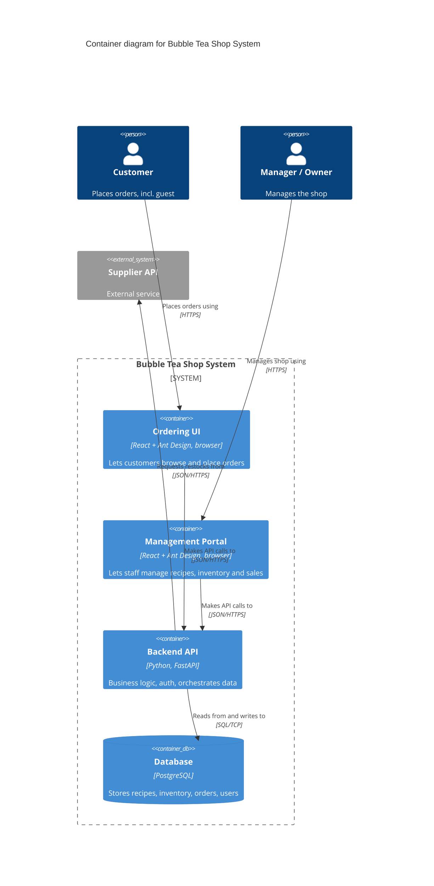

```mermaid
C4Container
    title Container diagram for Bubble Tea Shop System
    Person(customer, "Customer", "Places orders, incl. guest")
    Person(manager, "Manager / Owner", "Manages the shop")
    System_Boundary(shop, "Bubble Tea Shop System") {
        Container(webOrder, "Ordering UI", "React + Ant Design, browser", "Lets customers browse and place orders")
        Container(webAdmin, "Management Portal", "React + Ant Design, browser", "Lets staff manage recipes, inventory and sales")
        Container(api, "Backend API", "Python, FastAPI", "Business logic, auth, orchestrates data")
        ContainerDb(db, "Database", "PostgreSQL", "Stores recipes, inventory, orders, users")
    }
    System_Ext(supplier, "Supplier API", "External service")
    Rel(customer, webOrder, "Places orders using", "HTTPS")
    Rel(manager, webAdmin, "Manages shop using", "HTTPS")
    Rel(webOrder, api, "Makes API calls to", "JSON/HTTPS")
    Rel(webAdmin, api, "Makes API calls to", "JSON/HTTPS")
    Rel(api, db, "Reads from and writes to", "SQL/TCP")
    Rel(api, supplier, "Requests restocks from", "JSON/HTTPS")
```
