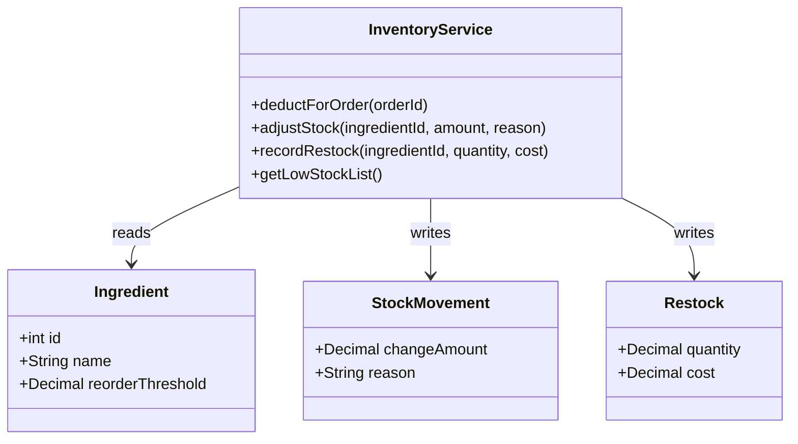

```mermaid
classDiagram
    class InventoryService {
        +deductForOrder(orderId)
        +adjustStock(ingredientId, amount, reason)
        +recordRestock(ingredientId, quantity, cost)
        +getLowStockList()
    }
    class Ingredient {
        +int id
        +String name
        +Decimal reorderThreshold
    }
    class StockMovement {
        +Decimal changeAmount
        +String reason
    }
    class Restock {
        +Decimal quantity
        +Decimal cost
    }
    InventoryService --> Ingredient : reads
    InventoryService --> StockMovement : writes
    InventoryService --> Restock : writes
```
