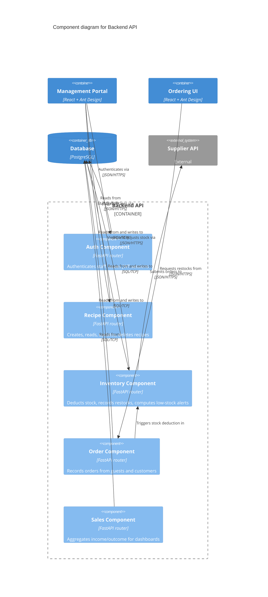

```mermaid
C4Component
    title Component diagram for Backend API
    Container(webAdmin, "Management Portal", "React + Ant Design")
    Container(webOrder, "Ordering UI", "React + Ant Design")
    ContainerDb(db, "Database", "PostgreSQL")
    System_Ext(supplier, "Supplier API", "External")
    Container_Boundary(api, "Backend API") {
        Component(auth, "Auth Component", "FastAPI router", "Authenticates staff, issues JWT sessions")
        Component(recipe, "Recipe Component", "FastAPI router", "Creates, reads, updates, deletes recipes")
        Component(inventory, "Inventory Component", "FastAPI router", "Deducts stock, records restocks, computes low-stock alerts")
        Component(order, "Order Component", "FastAPI router", "Records orders from guests and customers")
        Component(sales, "Sales Component", "FastAPI router", "Aggregates income/outcome for dashboards")
    }
    Rel(webAdmin, auth, "Authenticates via", "JSON/HTTPS")
    Rel(webAdmin, recipe, "Manages recipes via", "JSON/HTTPS")
    Rel(webAdmin, inventory, "Views and adjusts stock via", "JSON/HTTPS")
    Rel(webOrder, order, "Submits orders to", "JSON/HTTPS")
    Rel(order, inventory, "Triggers stock deduction in")
    Rel(inventory, supplier, "Requests restocks from", "JSON/HTTPS")
    Rel(recipe, db, "Reads from and writes to", "SQL/TCP")
    Rel(inventory, db, "Reads from and writes to", "SQL/TCP")
    Rel(order, db, "Reads from and writes to", "SQL/TCP")
    Rel(sales, db, "Reads from", "SQL/TCP")
    Rel(auth, db, "Reads from", "SQL/TCP")
```
