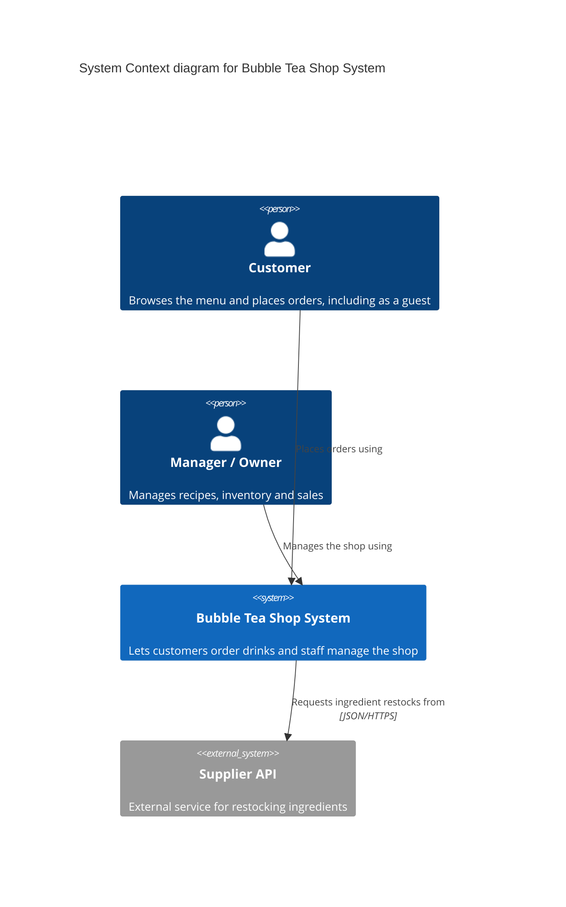

```mermaid
C4Context
    title System Context diagram for Bubble Tea Shop System
    Person(customer, "Customer", "Browses the menu and places orders, including as a guest")
    Person(manager, "Manager / Owner", "Manages recipes, inventory and sales")
    System(shop, "Bubble Tea Shop System", "Lets customers order drinks and staff manage the shop")
    System_Ext(supplier, "Supplier API", "External service for restocking ingredients")
    Rel(customer, shop, "Places orders using")
    Rel(manager, shop, "Manages the shop using")
    Rel(shop, supplier, "Requests ingredient restocks from", "JSON/HTTPS")
```
