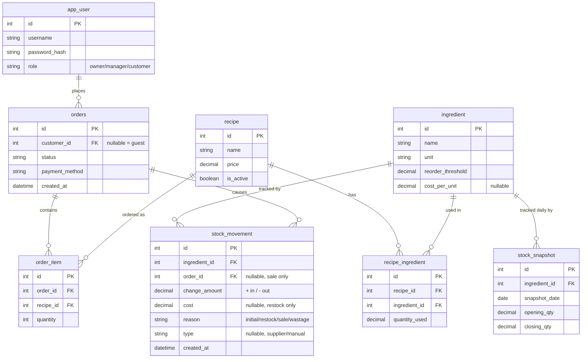

```mermaid
erDiagram
    ingredient {
        int id PK
        string name
        string unit
        decimal reorder_threshold
        decimal cost_per_unit "nullable"
    }
    recipe {
        int id PK
        string name
        decimal price
        boolean is_active
    }
    recipe_ingredient {
        int id PK
        int recipe_id FK
        int ingredient_id FK
        decimal quantity_used
    }
    orders {
        int id PK
        int customer_id FK "nullable = guest"
        string status
        string payment_method
        datetime created_at
    }
    order_item {
        int id PK
        int order_id FK
        int recipe_id FK
        int quantity
    }
    stock_movement {
        int id PK
        int ingredient_id FK
        int order_id FK "nullable, sale only"
        decimal change_amount "+ in / - out"
        decimal cost "nullable, restock only"
        string reason "initial/restock/sale/wastage"
        string type "nullable, supplier/manual"
        datetime created_at
    }
    stock_snapshot {
        int id PK
        int ingredient_id FK
        date snapshot_date
        decimal opening_qty
        decimal closing_qty
    }
    app_user {
        int id PK
        string username
        string password_hash
        string role "owner/manager/customer"
    }
    recipe ||--o{ recipe_ingredient : "has"
    ingredient ||--o{ recipe_ingredient : "used in"
    orders ||--o{ order_item : "contains"
    recipe ||--o{ order_item : "ordered as"
    ingredient ||--o{ stock_movement : "tracked by"
    orders ||--o{ stock_movement : "causes"
    ingredient ||--o{ stock_snapshot : "tracked daily by"
    app_user ||--o{ orders : "places"
```
