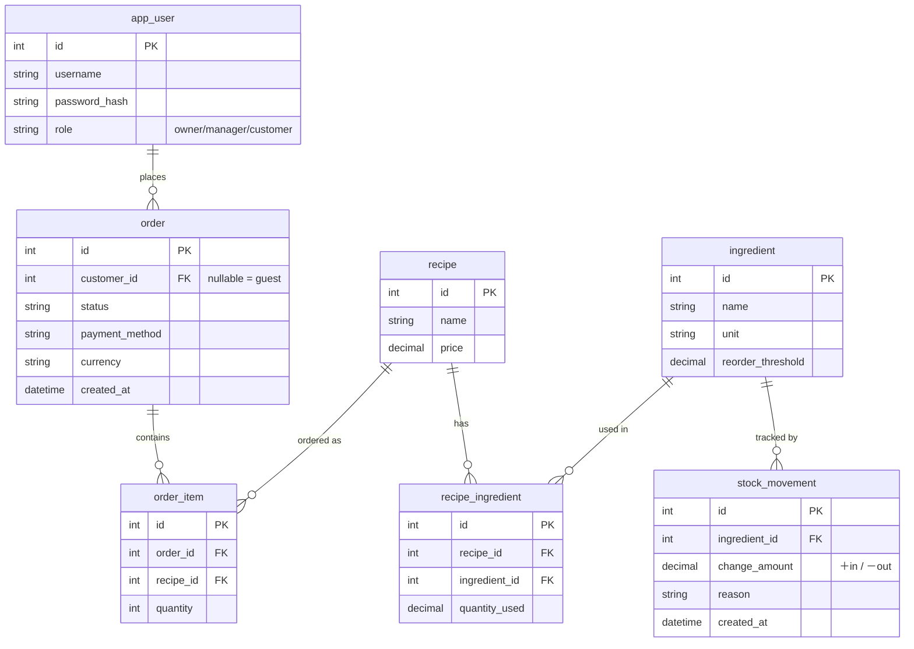

```mermaid
erDiagram
    ingredient {
        int id PK
        string name
        string unit
        decimal reorder_threshold
    }
    recipe {
        int id PK
        string name
        decimal price
    }
    recipe_ingredient {
        int id PK
        int recipe_id FK
        int ingredient_id FK
        decimal quantity_used
    }
    order {
        int id PK
        int customer_id FK "nullable = guest"
        string status
        string payment_method
        string currency
        datetime created_at
    }
    order_item {
        int id PK
        int order_id FK
        int recipe_id FK
        int quantity
    }
    stock_movement {
        int id PK
        int ingredient_id FK
        decimal change_amount "＋in / －out"
        string reason
        datetime created_at
    }
    app_user {
        int id PK
        string username
        string password_hash
        string role "owner/manager/customer"
    }
    recipe ||--o{ recipe_ingredient : "has"
    ingredient ||--o{ recipe_ingredient : "used in"
    order ||--o{ order_item : "contains"
    recipe ||--o{ order_item : "ordered as"
    ingredient ||--o{ stock_movement : "tracked by"
    app_user ||--o{ order : "places"
```
