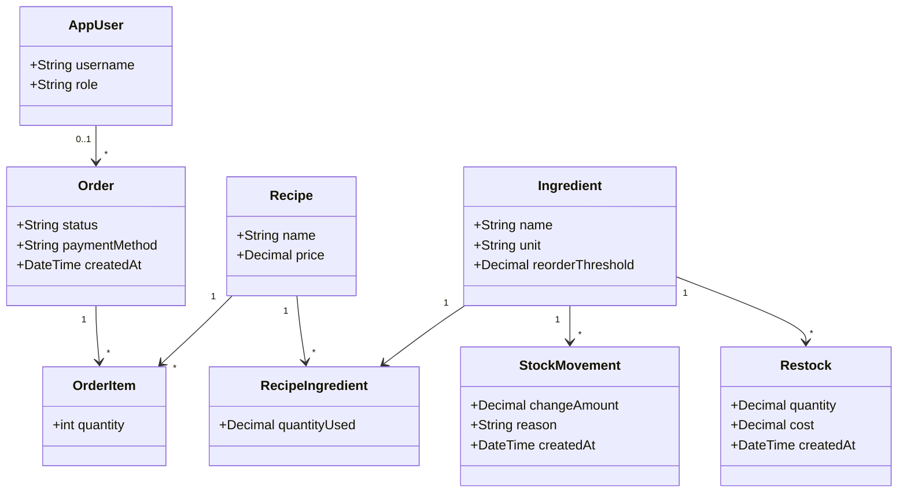

```mermaid
classDiagram
    class Ingredient {
        +String name
        +String unit
        +Decimal reorderThreshold
    }
    class Recipe {
        +String name
        +Decimal price
    }
    class RecipeIngredient {
        +Decimal quantityUsed
    }
    class Order {
        +String status
        +String paymentMethod
        +DateTime createdAt
    }
    class OrderItem {
        +int quantity
    }
    class StockMovement {
        +Decimal changeAmount
        +String reason
        +DateTime createdAt
    }
    class Restock {
        +Decimal quantity
        +Decimal cost
        +DateTime createdAt
    }
    class AppUser {
        +String username
        +String role
    }

    Recipe "1" --> "*" RecipeIngredient
    Ingredient "1" --> "*" RecipeIngredient
    Order "1" --> "*" OrderItem
    Recipe "1" --> "*" OrderItem
    Ingredient "1" --> "*" StockMovement
    Ingredient "1" --> "*" Restock
    AppUser "0..1" --> "*" Order
```
