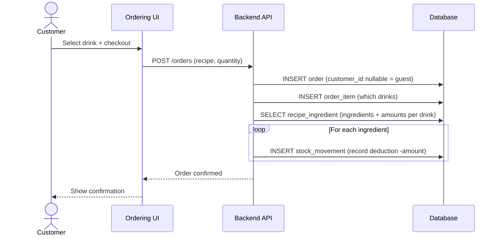

```mermaid
sequenceDiagram
    actor Customer
    participant UI as Ordering UI
    participant API as Backend API
    participant DB as Database

    Customer->>UI: Select drink + checkout
    UI->>API: POST /orders (recipe, quantity)
    API->>DB: INSERT order (customer_id nullable = guest)
    API->>DB: INSERT order_item (which drinks)
    API->>DB: SELECT recipe_ingredient (ingredients + amounts per drink)
    loop For each ingredient
        API->>DB: INSERT stock_movement (record deduction -amount)
    end
    API-->>UI: Order confirmed
    UI-->>Customer: Show confirmation
```
